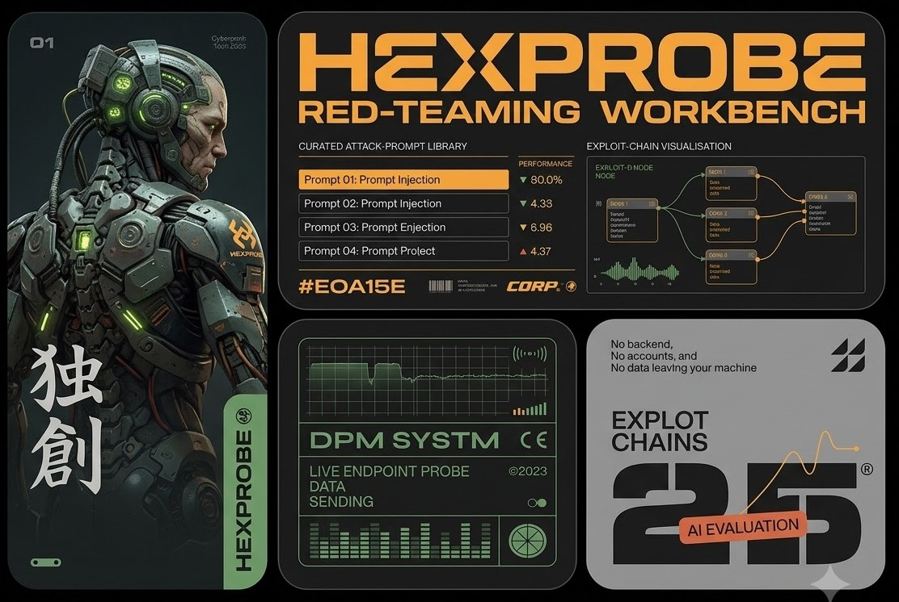

# HexProbe


> **Probe. Jailbreak. Report.**

A purpose-built, browser-based red-teaming workbench for security professionals testing large language model (LLM) applications. HexProbe combines a curated attack-prompt library, structured test logging, AI-assisted evaluation, live endpoint probing, determinism/temperature analysis, exploit-chain visualisation, and finding management — all running locally with no backend, no accounts, and no data leaving your machine.

---

## What it does

| Feature | Description |
|---|---|
| **Prompt Library** | 137+ curated attack prompts sourced from OWASP LLM Top 10, HiddenLayer APE Taxonomy (all 51 techniques, verbatim), and Arcanum PI Taxonomy v1.5 (28 techniques + 51 evasions). Filter by taxonomy, category, severity, or free-text search. One-click copy. |
| **Test Sessions** | Scope each engagement to a specific target — model name, provider, endpoint, description, tags, and lifecycle status (active / completed / archived). |
| **Prompt Lab** | Log prompt/response pairs against the active session. Classify outcome (vulnerable / partial / not-vulnerable / inconclusive) and severity. Promote any finding directly to the findings tracker. |
| **Direct Interaction** | Turn a sample HTTP request/response into a live probing console. An AI provider (Anthropic / OpenAI / Ollama) reads your sample exchange and generates a replayable *interaction spec* — URL, headers, body template, and the response path to the model's reply. Fire prompts at the real endpoint and inspect exact raw HTTP with the Verbose toggle. |
| **Temperature Probe** | Reuses the Direct Interaction spec to send N identical requests and analyse the endpoint's behaviour: determinism (fully / partially / non-deterministic), response-length token statistics, and rate-limit detection (HTTP 429). Sequential or concurrent firing modes, configurable request rate, per-request results table, and CSV export. |
| **CSV Import** | Bulk-import test entries from a CSV file. Includes a copyable LLM format prompt so you can paste unstructured notes into any LLM and get back a correctly formatted CSV. Preview and validate rows before committing. |
| **AI Evaluator** | Feed your logged entries (or a separate CSV) to an LLM judge — local **Ollama** or hosted **Anthropic** / **OpenAI** via your own API key. The evaluator scores each prompt/response pair as SUCCEEDED / PARTIAL / FAILED / INCONCLUSIVE, with confidence and reasoning. Results include an attack success rate, per-category breakdown, and CSV export. |
| **Exploit Chain** | Drag-and-drop ReactFlow canvas for modelling multi-step attack paths. Connect attack vectors → vulnerabilities → findings → impacts → mitigations. |
| **Reports & Findings** | Structured finding management with CVSS score, CWE ID, impact, recommendation, and linked evidence. Filter, edit, update status, and export as JSON. |

All data is stored in browser `localStorage` — nothing is sent to any server except the LLM endpoints and target endpoints you explicitly configure.

---

## Requirements

| Dependency | Version |
|---|---|
| Node.js | 18 or later |
| npm | 9 or later |
| Ollama *(optional)* | Latest — only needed if you want a fully local AI Evaluator / script builder |
| Anthropic or OpenAI API key *(optional)* | Only needed if you prefer a hosted model for the AI Evaluator, Direct Interaction script builder, or Temperature Probe |

---

## Installation

### 1. Clone the repository

```bash
git clone https://github.com/<your-username>/hexprobe.git
cd hexprobe
```

### 2. Install dependencies

```bash
npm install
```

### 3. Start the development server

```bash
npm run dev
```

The app will be available at **http://localhost:5173**.

### 4. Build for production (optional)

```bash
npm run build
npm run preview   # serves the built dist/ at http://localhost:4173
```

---

## AI provider setup

The AI Evaluator, the Direct Interaction script builder, and (indirectly) the Temperature Probe all use an LLM. You can pick one of three providers in **Prompt Lab → AI Evaluator → Configure**; the choice is shared across features.

### Option A — Ollama (fully local, no API key)

[Ollama](https://ollama.com) runs entirely on your machine.

```bash
ollama pull llama3.2       # good balance of speed and quality (~2 GB)
ollama pull mistral        # strong instruction-following (~4 GB)
ollama pull gemma3         # fast, low memory (~2 GB)
```

Because the app runs in a browser, Ollama must allow cross-origin requests:

**macOS / Linux:**
```bash
OLLAMA_ORIGINS="*" ollama serve
```

**Windows (PowerShell):**
```powershell
$env:OLLAMA_ORIGINS = "*"
ollama serve
```

Then set **Ollama Base URL** (default `http://localhost:11434`) and the **model name** in the app.

### Option B — Anthropic (hosted)

Paste an Anthropic API key in the configure panel and pick a Claude model (e.g. `claude-sonnet-4-6`, `claude-opus-4-7`, `claude-haiku-4-5-20251001`). Requests run directly from the browser.

### Option C — OpenAI (hosted)

Paste an OpenAI API key and pick a model (e.g. `gpt-4o`, `gpt-4o-mini`). Requests run directly from the browser.

> **Note on API keys:** keys are stored only in your browser's `localStorage` and sent only to the corresponding provider. Treat the machine running HexProbe as trusted.

---

## Usage workflow

### 1. Create a session
Go to **Test Sessions** → **New Session**. Fill in the target application name, model/provider, endpoint, and any scoping notes. The session becomes the active context for all subsequent test entries.

### 2. Choose attack prompts
Browse the **Prompt Library** to find relevant techniques. Filter by taxonomy (OWASP-LLM, APE, Arcanum), category (e.g. LLM01 Prompt Injection), or severity. Use **Copy** to grab the prompt.

### 3. Probe the live endpoint *(optional)*
In **Direct Interaction**, paste a sample HTTP request and response for your target's chat API. The AI builder generates an interaction spec; review and tweak it, then send prompts to the real endpoint and inspect raw HTTP with **Verbose**.

### 4. Check determinism & rate limits *(optional)*
In **Prompt Lab → Temperature Probe**, reuse the spec from Direct Interaction to fire N identical requests. Read the determinism verdict, response-length stats, and rate-limit detection; export the per-request results to CSV.

### 5. Log test entries
In **Prompt Lab → Test Lab**, paste your prompt and response, classify the outcome and severity, add notes and tags, and save to the Test Log. Or bulk-import via **CSV Import**.

### 6. Evaluate results automatically
In **Prompt Lab → AI Evaluator**, choose your source (session log or CSV upload) and provider, then click **Evaluate**. Results stream in per-entry with verdicts, confidence scores, and reasoning. Export as CSV.

### 7. Map the attack chain & report
Use **Exploit Chain** to diagram the attack path. From any Test Log entry marked vulnerable or partial, click **Promote to Finding** to create a structured finding with CVSS, CWE, impact, and recommendation. View, filter, and export all findings from **Reports**.

---

## CSV Import format

The CSV importer accepts files with the following columns:

```
title, category, category_name, severity, outcome, prompt, response, notes, tags
```

| Column | Required | Values |
|---|---|---|
| `title` | ✅ | Any string |
| `category` | ✅ | `LLM01`–`LLM10`, `APE`, `ARC`, `ARC-TEC`, `ARC-EVA`, `CUSTOM` |
| `category_name` | — | Human-readable label, e.g. `Prompt Injection` |
| `severity` | — | `critical` · `high` · `medium` · `low` · `info` |
| `outcome` | — | `vulnerable` · `partial` · `not-vulnerable` · `inconclusive` |
| `prompt` | ✅ | The exact prompt sent to the model |
| `response` | — | The model's response (leave empty if untested) |
| `notes` | — | Analysis notes |
| `tags` | — | Comma-separated, e.g. `jailbreak,LLM01` |

Download a template from **Prompt Lab → CSV Import → Example CSV**.

---

## Temperature Probe CSV export

The Temperature Probe exports one row per request with these columns (mirroring a standard determinism/rate-limit harness):

```
request_number, timestamp, status_code, success, response_text, error_text, response_time_ms, conversation_id
```

---

## Taxonomy reference

### OWASP LLM Top 10
| ID | Category |
|---|---|
| LLM01 | Prompt Injection |
| LLM02 | Insecure Output Handling |
| LLM03 | Training Data Poisoning |
| LLM04 | Model Denial of Service |
| LLM05 | Supply Chain Vulnerabilities |
| LLM06 | Sensitive Information Disclosure |
| LLM07 | Insecure Plugin Design |
| LLM08 | Excessive Agency |
| LLM09 | Overreliance |
| LLM10 | Model Theft |

### HiddenLayer APE Taxonomy
| Tactic | Description |
|---|---|
| HL01 — Obfuscation | ASCII-art, Base64, payload splitting, language obfuscation |
| HL02 — Lore Abuse | Cultural knowledge exploits, word games, synonym attacks |
| HL03 — Cognitive Manipulation | DAN, crescendo, refusal suppression, instruction override |
| HL04 — Token Manipulation | Glitch tokens, GCG adversarial suffixes, token boundary injection |
| HL05 — Context Manipulation | Few-shot poisoning, control token injection, policy puppetry |
| HL06 — Output Structuring | Summarisation, creative output, output pruning |
| HL07 — Attack Augmentation | Stacking, concatenation, multi-turn, RAG indirect visibility |
| HL08 — Multi-LLM Attacks | Recursive injection across LLM pipelines |

Source: [github.com/hiddenlayerai/ape-taxonomy](https://github.com/hiddenlayerai/ape-taxonomy)

### Arcanum PI Taxonomy v1.5
- **ARC-TEC** — 28 attack techniques (terminal simulation, encoding bypass, recursive self-reference, policy override, template injection, etc.)
- **ARC-EVA** — 51 evasion techniques (numeric encoding, historical writing systems, zero-width steganography, Unicode variants, Morse code, etc.)

---

## Project structure

```
src/
├── components/
│   ├── Layout.tsx            # Sidebar navigation shell
│   ├── Dashboard.tsx         # Overview stats and quick links
│   ├── Sessions.tsx          # Session management CRUD
│   ├── PromptLab.tsx         # Test Lab + Temperature Probe + CSV Import + AI Evaluator tabs
│   ├── DirectInteraction.tsx # Sample request/response → live probing console
│   ├── TemperatureProbe.tsx  # Determinism / rate-limit probing
│   ├── CsvImport.tsx         # CSV ingestion with preview and validation
│   ├── EvaluationPanel.tsx   # Multi-provider attack evaluation engine
│   ├── PromptLibrary.tsx     # Searchable/filterable prompt browser
│   ├── ExploitChain.tsx      # ReactFlow exploit path builder
│   └── Reports.tsx           # Findings tracker and export
├── data/
│   └── prompts.ts            # All 137+ prompt library entries
├── hooks/
│   └── useStore.ts           # Global state (localStorage persistence)
├── types/
│   └── index.ts              # TypeScript interfaces
└── utils/
    ├── aiProvider.ts         # Shared LLM provider config + chat completion (Ollama/Anthropic/OpenAI)
    ├── interactionSpec.ts    # Interaction-spec model + endpoint replay (shared by Direct Interaction & Temperature Probe)
    └── csvParser.ts          # RFC-4180 CSV parser
```

---

## Tech stack

| Library | Purpose |
|---|---|
| React 18 + TypeScript | UI framework |
| Vite | Build tooling and dev server |
| Tailwind CSS | Styling (custom cyberpunk theme) |
| ReactFlow | Exploit chain canvas |
| Lucide React | Icons |
| uuid | Entry ID generation |
| Ollama / Anthropic / OpenAI REST APIs | LLM evaluation & script building (bring your own) |

---

## Data persistence

All sessions, test entries, findings, and exploit chains are stored in your browser's `localStorage`. No data is transmitted to any external server except the LLM and target endpoints you configure.

To back up your data: **Reports → Export** downloads a full JSON snapshot.
To restore: **Reports → Import** loads a previously exported JSON file.

---

## Disclaimer

HexProbe is intended for **authorised security testing and research only**. Use it solely against systems you own or have explicit written permission to test. The authors accept no liability for misuse.
